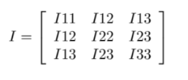

# hands_on_Aug10
Step by step learning g2o optimization
Input file format:
## VERTICES (lines starting with “VERTEX_SE2” in g2o): 
Description of the vertices of the pose graph: 
Each line follows the format: “ID x y th”, where “ID” is a unique index assigned to the corresponding pose,and “x”, “y”, “th” describe the initial guess (usually obtained from odometry) of the pose. “x” and “y” are the initial guess of node’s planar position, while “th” is the initial guess for node’s orientation (in radians); 
## EDGES (lines starting with “EDGE_SE2” in g2o): 
description of the edges of the pose graph. The ordering of the elements in the EDGES description becomes: “IDout IDindx dy dth I11 I12 I13 I22 I23 I33”. Moreover, the corresponding information matrices need to be changed as described in the next section.

